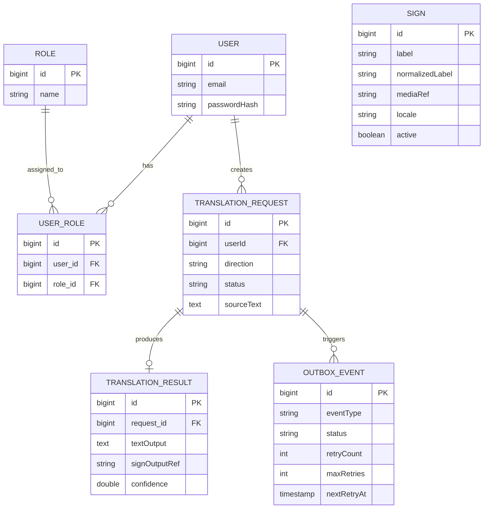

# PROYECTO-KINETICA

Backend MVP para aplicacion de traduccion de lenguaje de señas peruano (LSP) a texto/audio en Espanol, y viceversa.

## Stack Tecnologico

- Java 17
- Spring Boot 4.0.6
- Spring Data JPA
- Spring Security (JWT + OAuth2)
- PostgreSQL 15
- Maven

## Modulos

- **auth**: Autenticacion JWT, refresh tokens, roles (USER/ADMIN)
- **sign**: Catalogo de señas (CRUD)
- **translation**: Traducciones async con patron outbox
- **media**: Referencias a contenido multimedia
- **feedback**: Feedback de usuarios

## Configuracion

Las variables de entorno se configuran en `.env`:

```bash
POSTGRES_PORT=5432
POSTGRES_DB=kinetica
SPRING_DATASOURCE_USERNAME=postgres
SPRING_DATASOURCE_PASSWORD=tu_password
APP_SECURITY_JWT_SECRET=tu_secret_jwt_min_32_chars
```

## Ejecucion Local

```bash
# Cargar variables de entorno
source .env

# Correr aplicacion
./mvnw spring-boot:run

# O usar el script
./run-spring.sh
```

## Tests

```bash
./mvnw test
```

## Construccion

```bash
./mvnw package
```

## CI/CD

GitHub Actions corre los tests automaticamente en pushes a main/develop y PRs.

## Endpoints Principales

- `POST /auth/register` - Registro de usuarios
- `POST /auth/login` - Login
- `POST /auth/refresh` - Refresh token
- `POST /auth/logout` - Logout
- `GET /signs` - Listar señas (requiere auth)
- `POST /signs` - Crear señas (solo ADMIN)
- `POST /translations` - Crear traduccion
- `GET /translations` - Listar traducciones
- `POST /translations/{requestId}/media/upload` - Subir media gestionada por backend
- `GET /kpis/translations?days=7` - KPIs de traduccion (solo ADMIN)
- `GET /users` - Listar usuarios (solo ADMIN)
- `GET /roles` - Listar roles (solo ADMIN)

## Diagrama Entidad Relacion



## Descripcion de Entidades

- **User**: Usuario del sistema (id, email, passwordHash)
- **Role**: Rol (id, name) -> USER, ADMIN
- **UserRole**: Relacion usuario-rol
- **Sign**: Seña del catalogo (id, label, normalizedLabel, mediaRef, locale, active)
- **TranslationRequest**: Solicitud de traduccion (id, userId, direction, status, sourceText)
- **TranslationResult**: Resultado (id, request_id, textOutput, signOutputRef, confidence)
- **OutboxEvent**: Evento outbox para async (id, status, retryCount, maxRetries, nextRetryAt)

## Relaciones

- User 1:N UserRole N:1 Role
- User 1:N TranslationRequest
- TranslationRequest 1:1 TranslationResult
- TranslationRequest 1:N OutboxEvent

## Roles

- `USER` - Usuario regular
- `ADMIN` - Administrador

## Arquitectura de Seguridad

- JWT stateless con session STATELESS
- Deny-by-default: todas las rutas bloqueadas salvo allowlist
- Validacion de issuer/audience en JWT
- Refresh tokens con rotacion y lock pesimista
- Outbox con reintentos y backoff exponencial
