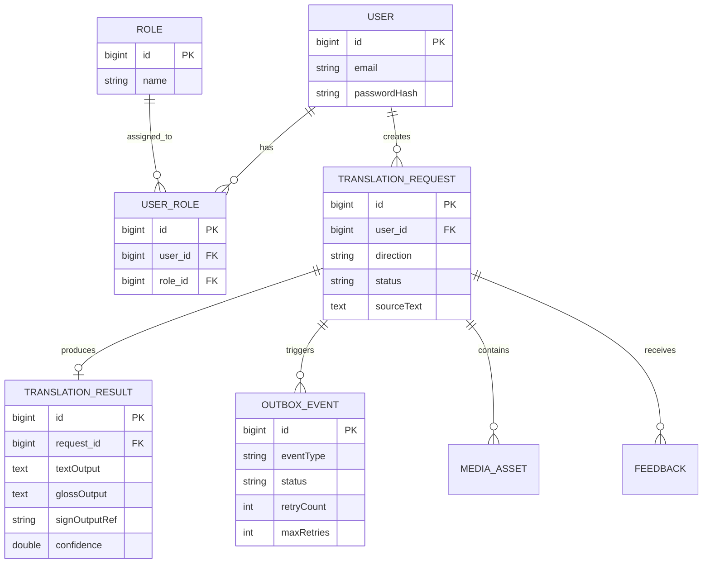
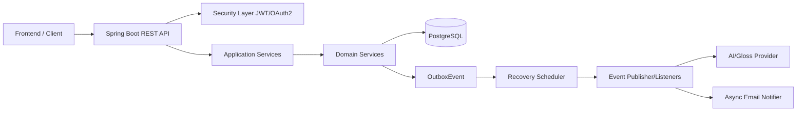

# KINETICA Backend


## Portada

**Título del Proyecto:** KINETICA Backend — Plataforma de traducción bidireccional entre Lengua de Señas Peruana (LSP) y español

**Curso:** CS 2031 Desarrollo Basado en Plataforma

**Repositorio:** https://github.com/Limepal/PROYECTO-KINETICA

---

## Índice

1. [Introducción](#introducción)
2. [Identificación del Problema o Necesidad](#identificación-del-problema-o-necesidad)
3. [Descripción de la Solución](#descripción-de-la-solución)
4. [Modelo de Entidades](#modelo-de-entidades)
5. [Testing y Manejo de Errores](#testing-y-manejo-de-errores)
6. [Medidas de Seguridad Implementadas](#medidas-de-seguridad-implementadas)
7. [Eventos y Asincronía](#eventos-y-asincronía)
8. [GitHub & Management](#github--management)
9. [Conclusión](#conclusión)
10. [Apéndices](#apéndices)

---

## Introducción

### Contexto

La comunicación entre personas sordas usuarias de Lengua de Señas Peruana (LSP) y personas oyentes sigue presentando barreras en contextos cotidianos, educativos y de servicios. En muchos escenarios, no existe disponibilidad inmediata de intérpretes humanos, lo que limita la accesibilidad y la inclusión. A partir de este contexto, KINETICA surge como un backend especializado para habilitar flujos de traducción digital asistida por IA, con foco en robustez técnica, seguridad y mantenibilidad.

El proyecto implementa una API REST para autenticación, gestión de usuarios y roles, catálogo de señas, solicitudes de traducción, resultados, activos multimedia y feedback. Además, incorpora un pipeline asíncrono basado en eventos (Outbox + listeners), con el objetivo de desacoplar operaciones costosas del ciclo de vida de la request HTTP y mejorar la resiliencia del sistema.

### Objetivos del Proyecto

1. Diseñar e implementar una API backend segura y escalable para traducción bidireccional LSP↔español.
2. Asegurar buenas prácticas de arquitectura por capas (application/domain/infrastructure).
3. Incorporar control de acceso por roles, JWT y OAuth2 para autenticación/autorización.
4. Implementar procesamiento asíncrono y orientado a eventos para tareas de traducción y notificaciones.
5. Garantizar calidad mediante pruebas unitarias, de integración y validación de contratos de error.

---

## Identificación del Problema o Necesidad

### Descripción del Problema

El problema central es la falta de mecanismos tecnológicos que permitan una interacción fluida y confiable entre personas que se comunican con LSP y quienes utilizan español escrito/hablado. Este problema tiene dos aristas técnicas importantes:

- La traducción no es un proceso trivial y suele depender de procesamiento especializado.
- En sistemas reales, operaciones de IA pueden ser lentas o fallar, por lo que se requiere tolerancia a fallos y recuperación.

### Justificación

Resolver este problema es relevante porque mejora accesibilidad, inclusión y continuidad comunicacional. Desde el punto de vista de ingeniería, también permite aplicar prácticas de plataforma modernas: seguridad robusta, arquitectura desacoplada, eventos, asincronía y testing extensivo. El resultado no es solo una API funcional, sino un backend diseñado para evolucionar de MVP a producción con menor deuda técnica.

---

## Descripción de la Solución

### Funcionalidades Implementadas

- **Autenticación y autorización:** registro, login, refresh, logout, JWT, OAuth2 Google.
- **Gestión de usuarios y roles:** administración por endpoints protegidos con roles `USER`, `ADMIN`, `MANAGER`.
- **Catálogo de señas:** CRUD completo para recurso `signs`.
- **Traducciones:** creación, consulta, actualización parcial y eliminación de solicitudes.
- **Media assets:** subida/registro/listado/eliminación de media asociada a solicitudes.
- **Feedback:** retroalimentación de usuarios sobre traducciones.
- **KPIs:** métricas de traducción para monitoreo operativo.
- **Conversión lingüística:** endpoints de conversión español↔glosa.
- **Eventos y reintentos:** patrón Outbox con scheduler de recuperación y listeners.
- **Notificación de bienvenida por correo:** flujo basado en evento de registro de usuario.

### Tecnologías Utilizadas

- **Lenguaje / Runtime:** Java 17
- **Framework:** Spring Boot 4.0.6
- **Persistencia:** Spring Data JPA + PostgreSQL
- **Seguridad:** Spring Security (JWT Resource Server + OAuth2)
- **Build:** Maven
- **Testing:** JUnit 5, Mockito, Spring Test, Testcontainers
- **Correo:** JavaMailSender + plantilla HTML (Thymeleaf)
- **Asincronía / Scheduler:** `@EnableAsync`, `@Async`, `@Scheduled`, `ThreadPoolTaskExecutor`
- **CI:** GitHub Actions
- **Documentación de API:** OpenAPI (`OPENAPI_MVP_V1.yaml`)

### Estructura del Proyecto

```text
.
├── docker-compose.yml
├── OPENAPI_MVP_V1.yaml
├── pom.xml
├── README.md
├── run-spring.sh
├── src
│   ├── main
│   │   ├── java
│   │   └── resources
│   └── test
│       ├── java
│       └── resources
└── .github
    └── workflows
        └── ci.yml
```

Descripción rápida:

- `src/main/java`: lógica de negocio, controladores, seguridad, eventos, asincronía e infraestructura.
- `src/main/resources`: configuración de Spring y plantillas de correo HTML.
- `src/test/java`: tests unitarios, integración y persistencia (`@DataJpaTest`, seguridad, flujos auth).
- `docker-compose.yml`: entorno local de PostgreSQL.
- `OPENAPI_MVP_V1.yaml`: contrato de API.
- `.github/workflows/ci.yml`: pipeline de CI con ejecución de tests.

### Endpoints Documentados (versión actual)

> Base path REST: `/api/v1`

#### Auth

- `POST /api/v1/auth/register`
- `POST /api/v1/auth/login`
- `POST /api/v1/auth/refresh`
- `POST /api/v1/auth/logout`
- `GET /oauth2/authorization/google`

#### Users / Roles

- `GET /api/v1/users`
- `GET /api/v1/users/{id}`
- `PATCH /api/v1/users/{id}`
- `DELETE /api/v1/users/{id}`
- `GET /api/v1/roles`
- `GET /api/v1/roles/{id}`
- `POST /api/v1/roles`
- `DELETE /api/v1/roles/{id}`
- `POST /api/v1/roles/users/{userId}`

#### Signs

- `GET /api/v1/signs`
- `POST /api/v1/signs`
- `GET /api/v1/signs/{id}`
- `PUT /api/v1/signs/{id}`
- `DELETE /api/v1/signs/{id}`

#### Translations

- `POST /api/v1/translations`
- `GET /api/v1/translations`
- `GET /api/v1/translations/{id}`
- `PATCH /api/v1/translations/{id}`
- `DELETE /api/v1/translations/{id}`

#### Media

- `POST /api/v1/translations/{requestId}/media` (JSON)
- `POST /api/v1/translations/{requestId}/media` (multipart)
- `GET /api/v1/translations/{requestId}/media`
- `GET /api/v1/translations/{requestId}/media/{mediaId}`
- `DELETE /api/v1/translations/{requestId}/media/{mediaId}`

#### Feedback

- `POST /api/v1/translations/{requestId}/feedback`
- `GET /api/v1/translations/{requestId}/feedback`
- `GET /api/v1/translations/{requestId}/feedback/{feedbackId}`
- `DELETE /api/v1/translations/{requestId}/feedback/{feedbackId}`

#### Conversiones y KPI

- `POST /api/v1/conversions/es-to-gloss`
- `POST /api/v1/conversions/gloss-to-es`
- `GET /api/v1/kpis/translations?days=7`

### Instalación y ejecución local

```bash
# 1) Clonar
git clone https://github.com/Limepal/PROYECTO-KINETICA.git
cd PROYECTO-KINETICA

# 2) Configurar variables
cp .env.example .env

# 3) Levantar PostgreSQL local
docker compose up -d

# 4) Ejecutar backend
./run-spring.sh
# o
./mvnw spring-boot:run
```

### Variables de entorno requeridas

```bash
POSTGRES_PORT=5432
POSTGRES_DB=kinetica
SPRING_DATASOURCE_USERNAME=postgres
SPRING_DATASOURCE_PASSWORD=your_password_here

APP_SECURITY_JWT_SECRET=your_256_bit_secret_key_min_32_chars_here
APP_SECURITY_CORS_ALLOWED_ORIGINS=http://localhost:3000,http://127.0.0.1:3000
APP_SECURITY_CORS_ALLOWED_METHODS=GET,POST,PUT,DELETE,OPTIONS
APP_SECURITY_CORS_ALLOWED_HEADERS=Authorization,Content-Type

KINETICA_MEDIA_STORAGE_ROOT=./storage/media
KINETICA_MEDIA_RETENTION_DAYS=30
KINETICA_MEDIA_RETENTION_SCAN_MS=3600000

KINETICA_GLOSS_PROVIDER=github
GITHUB_MODELS_URL=https://models.github.ai/inference
MODEL_ID=openai/gpt-4o-mini
GITHUB_TOKEN=

APP_MAIL_ENABLED=false
APP_MAIL_FROM=no-reply@kinetica.local
APP_MAIL_WELCOME_SUBJECT=Bienvenido a Kinetica
SPRING_MAIL_HOST=
SPRING_MAIL_PORT=587
SPRING_MAIL_USERNAME=
SPRING_MAIL_PASSWORD=

SPRING_SECURITY_OAUTH2_CLIENT_REGISTRATION_GOOGLE_CLIENT_ID=
SPRING_SECURITY_OAUTH2_CLIENT_REGISTRATION_GOOGLE_CLIENT_SECRET=
APP_OAUTH2_SUCCESS_REDIRECT=http://localhost:3000/auth/callback
APP_OAUTH2_FAILURE_REDIRECT=http://localhost:3000/auth/error
```

---

## Modelo de Entidades

### Diagrama Entidad-Relación (ER)



### Descripción de Entidades

- **User / Role / UserRole:** base de autenticación y autorización por roles.
- **TranslationRequest:** solicitud de traducción emitida por un usuario.
- **TranslationResult:** resultado final de la traducción (texto, glosa, referencias, métricas).
- **OutboxEvent:** persistencia de eventos para desacoplar procesamiento asíncrono y habilitar reintentos.
- **MediaAsset:** activos multimedia asociados a una solicitud.
- **Feedback:** evaluación del usuario sobre la calidad del resultado.

---

## Testing y Manejo de Errores

### Niveles de Testing Realizados

- **Unitarias:** servicios de dominio, utilitarios de seguridad, parser de outbox.
- **Integración:** controladores de auth/authorization/error envelope.
- **Persistencia (`@DataJpaTest`):** repositorios con queries y edge cases.
- **Infraestructura con Testcontainers:** PostgreSQL real para validar comportamiento cercano a producción.

### Resultados

El proyecto mantiene una suite estable con cobertura amplia de módulos críticos (auth, traducción, repositorios, seguridad y manejo de errores). Durante el desarrollo se corrigieron fallos relevantes como: mapeo inconsistente de excepciones, colisiones de constraints por drift de esquema y desalineación de rutas de API.

### Manejo de Errores

Se utiliza `@RestControllerAdvice` centralizado con respuesta uniforme (`ApiErrorResponse`) y códigos HTTP consistentes (`400, 401, 403, 404, 409, 500`). Además, los handlers de seguridad (401/403) retornan el mismo esquema para mantener consistencia de contrato entre errores de negocio y errores de autenticación/autorización.

---

## Medidas de Seguridad Implementadas

### Seguridad de Datos

- **JWT stateless** para autenticación de requests.
- **Refresh tokens** con hash persistido y revocación.
- **BCrypt** para hashing de contraseñas.
- **CORS explícito** por variables de entorno.
- **Roles en BD y claims JWT** (`USER`, `ADMIN`, `MANAGER`).

### Prevención de Vulnerabilidades

- **SQL Injection:** mitigado por JPA + parámetros tipados.
- **CSRF:** deshabilitado en API stateless con JWT (estrategia intencional para backend REST).
- **Acceso no autorizado:** deny-by-default + `@PreAuthorize` en endpoints y capa de servicios sensibles.
- **Validación de entrada:** `@Valid` + constraints en DTOs.

---

## Eventos y Asincronía

### Eventos implementados

El sistema usa múltiples eventos de dominio para desacoplar responsabilidades:

1. `TranslationRequestedEvent`
2. `TranslationCompletedEvent`
3. `TranslationFailedEvent`
4. `UserRegisteredEvent`
5. `MediaAssetUploadedEvent`

Estos eventos separan la capa de comandos HTTP del procesamiento pesado, permiten auditoría y facilitan la evolución del sistema sin acoplar módulos.

### ¿Por qué asíncronos?

- Reducen latencia percibida por el cliente.
- Evitan bloquear transacciones de request/response en tareas lentas (IA, mail).
- Mejoran resiliencia frente a fallos transitorios.

### Implementación async

- `@EnableAsync` en la aplicación.
- `ThreadPoolTaskExecutor` dedicado (`appTaskExecutor`).
- Listeners y handlers con `@Async("appTaskExecutor")`.
- Scheduler de recuperación de outbox para reprocesar pendientes/fallidos.

---

## GitHub & Management

### Gestión de tareas

El equipo utiliza GitHub como sistema de colaboración y trazabilidad, con estrategia de trabajo por issues/PRs y ramas por feature/fix. Para evaluación final se recomienda evidenciar explícitamente:

- Issues con labels (`bug`, `feature`, `docs`, `security`, `testing`).
- Milestones por sprint/entrega.
- Board de proyecto (To Do / In Progress / Done).

### GitHub Actions

Se implementó CI en `.github/workflows/ci.yml` que:

1. Configura JDK 17.
2. Levanta PostgreSQL con Docker Compose.
3. Inyecta variables necesarias para test.
4. Ejecuta `./mvnw clean test`.
5. Publica reportes cuando hay fallos.

Este flujo permite detectar regresiones tempranas y mantener calidad continua.

---

## Conclusión

### Logros del Proyecto

KINETICA backend logró implementar una base técnica sólida para traducción bidireccional LSP↔español con seguridad, arquitectura desacoplada y cobertura de pruebas robusta. Se consolidó una API versionada, control de acceso por roles, pipeline asíncrono con eventos y mecanismos de recuperación operativa mediante outbox.

### Aprendizajes Clave

- Diseñar APIs REST implica mantener consistencia entre código, OpenAPI y documentación.
- Seguridad efectiva requiere combinar autenticación, autorización y contratos de error estables.
- Eventos y asincronía no solo mejoran performance: también mejoran mantenibilidad y resiliencia.
- El testing de integración con DB real (Testcontainers) reduce sorpresas entre entornos.

### Trabajo Futuro

- Incorporar recuperación de contraseña por correo (flujo completo).
- Extender observabilidad (métricas técnicas + trazas distribuidas).
- Mejorar estrategias de cache para endpoints de catálogo.
- Publicar despliegue productivo con infraestructura reproducible (IaC).

---

## Apéndices

### Decisiones de Diseño Relevantes

- Arquitectura en capas `application/domain/infrastructure`.
- Outbox para desacoplar traducción del request HTTP.
- Estandarización de errores globales para frontend estable.
- Rutas versionadas `/api/v1` para evolución de contrato.

### Diagrama de Arquitectura (alto nivel)



### Licencia

Este proyecto se documenta para ser distribuido bajo **GNU General Public License v3.0 (GPL-3.0)**.

### Referencias

- Spring Boot Docs: https://docs.spring.io/spring-boot/
- Spring Security Docs: https://docs.spring.io/spring-security/
- Spring Data JPA Docs: https://docs.spring.io/spring-data/jpa/
- Testcontainers Docs: https://www.testcontainers.org/
- OpenAPI Specification: https://spec.openapis.org/oas/latest.html
